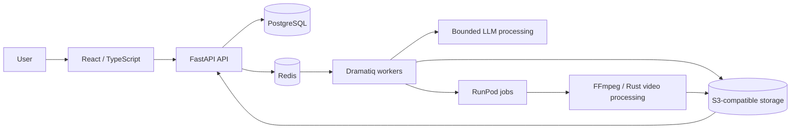

# Clippex — AI Video Processing Platform

Paid commercial freelance project · Client pilot · Four-person team · Role:
Backend / Full-Stack Developer · January–March 2026

## Product

Clippex turns long-form source video into structured short clips. The platform
manages projects, processes transcripts with LLM-assisted logic, schedules
background media jobs, stores intermediate and final assets in S3-compatible
object storage, and exposes processing state and results through a web
interface.

The product reached a client pilot, where the components I developed were used.
The core processing pipeline was validated with feature-length source videos of
up to approximately two hours. This does not imply mass adoption or production
scale.

## Architecture

## My Contribution

I was responsible for the core backend processing pipeline within the team:

- developed and iterated on the FastAPI backend, project APIs, schemas, and
  processing-state flows;
- worked with PostgreSQL and Redis to store project state and coordinate
  asynchronous workloads;
- implemented background processing with Dramatiq and worker-side pipeline
  logic;
- introduced bounded chunk processing for long transcripts and segment sets to
  prevent LLM context overflow;
- integrated RunPod jobs, S3-compatible object storage, FFmpeg processing, and
  a Rust video-processing service;
- implemented selected React/TypeScript flows for project creation, lists,
  details, processing state, and generated results.

## Engineering Decisions

Long-running LLM and media operations were kept outside synchronous API
requests. PostgreSQL stores durable project state, Redis coordinates queued
work, and object storage carries large artifacts between processing stages.
Long transcripts are processed in bounded chunks instead of one oversized LLM
request.

## Scope

This was a team-built client pilot. I claim responsibility for the backend
processing areas listed above, not sole authorship of the complete product. No
claims are made about user counts, revenue, production scale, cost savings, or
unmeasured performance improvements.

## Technology

Python, FastAPI, PostgreSQL, Redis, Dramatiq, Docker, RunPod, S3-compatible
storage, FFmpeg, Rust, React, and TypeScript.
