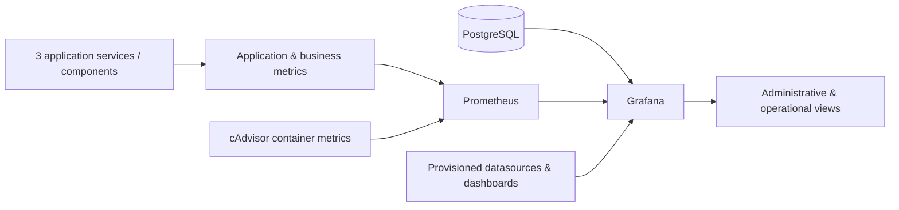

# Multi-Service Platform Observability

Commercial team project · Completed client delivery · Five-person team · Role:
Backend / Observability Contributor · September–October 2025

## Project Context

The product is a private multi-service client platform. I completed and
delivered a focused monitoring workstream that made application, business,
container, and database signals available through reproducible Prometheus and
Grafana configuration.

The verified monitoring configuration covers three application services or
components, with additional container and PostgreSQL-backed telemetry. My
current contribution is represented across approximately eight Grafana
dashboard views used for the client's administrative and operational work.

## Monitoring Architecture

## My Contribution

- developed application and business metric collection;
- configured Prometheus collection for three application services or
  components;
- created reproducible Grafana datasource provisioning;
- built and iterated on approximately eight dashboard views covering service
  health, operations, reporting, assets, payments, statistics, and withdrawals;
- connected PostgreSQL-backed operational views where appropriate;
- integrated Prometheus, Grafana, and cAdvisor with Docker Compose;
- kept datasource and dashboard definitions under version control so the
  monitoring environment could be reproduced for delivery.

## Engineering Value

The work turned service, business, container, and database signals into a
delivered set of administrative and operational views. Provisioned dashboards
and datasources reduced dependence on one-off manual Grafana setup.

## Scope

This was a completed observability workstream inside a larger team-owned
platform. It is not presented as sole authorship of the platform or as a
confirmed production-monitoring deployment. No unmeasured claims are made about
incidents, downtime, debugging speed, or manual effort.

## Technology

Python, Prometheus, Grafana, PostgreSQL, cAdvisor, Docker Compose, and
version-controlled JSON/YAML provisioning.
